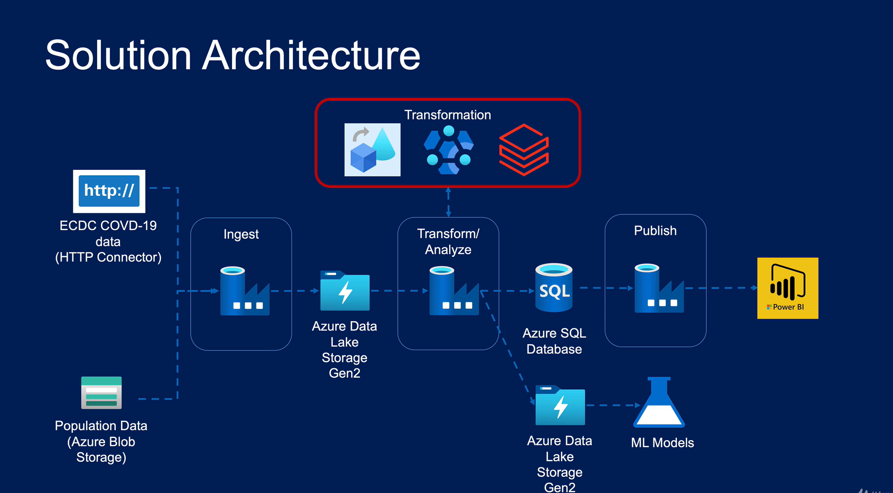
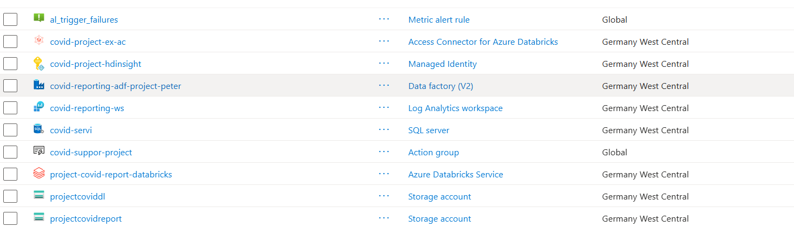
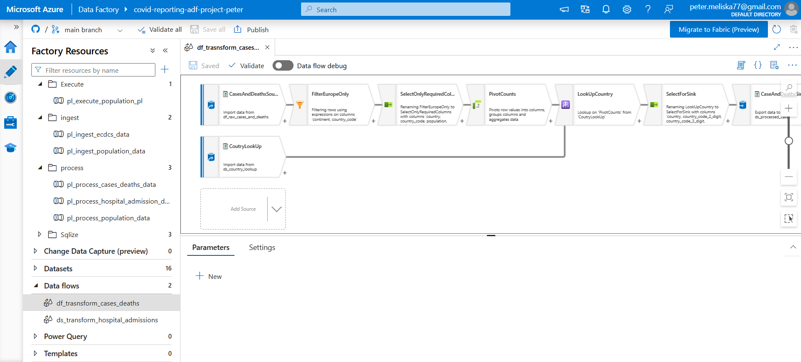

# Azure Data Factory COVID Reporting Pipeline

An end-to-end Azure data engineering project that orchestrates the ingestion, validation, transformation and serving of European COVID-19 data. The solution uses Azure Data Factory as the orchestration layer, Azure Data Lake Storage Gen2 for layered storage, Mapping Data Flows and Azure Databricks for transformation, and Azure SQL Database as the reporting layer.

The project prepares reporting-ready datasets for COVID-19 cases, deaths, hospital and ICU admissions, testing and population analysis. Its output can be consumed by Power BI, SQL clients or other analytics tools.

> **Portfolio focus:** metadata-driven ingestion, dependent triggers, event-driven processing, data quality validation, cloud transformation, monitoring and Git-integrated ADF development.

## Solution highlights

- **9 ADF pipelines** separated into ingestion, processing, execution and SQL serving layers.
- **2 Mapping Data Flows** for cases/deaths and hospital-admission transformations.
- **16 datasets**, **6 linked services** and **6 triggers** stored as source-controlled ADF JSON definitions.
- **Metadata-driven ingestion** from multiple ECDC CSV endpoints using a configuration file, Lookup and parallel ForEach execution.
- **Data quality gate** that validates the population file, reads its metadata and verifies the expected 13-column structure before processing.
- **Daily dependency chain** implemented with 24-hour Tumbling Window triggers.
- **Event-driven population pipeline** started when a new compressed population file arrives in Blob Storage.
- **Reporting layer in Azure SQL Database** loaded from curated files in ADLS Gen2.
- **Operational monitoring** through Log Analytics, a metric alert rule and an Azure Monitor action group.

## Architecture

The architecture separates orchestration, storage, transformation and serving concerns. Raw source files are preserved in the data lake, transformations write curated outputs to a separate processed layer, and the final relational tables are exposed through Azure SQL Database.

### Azure resource group

The regional services are deployed in **Germany West Central**; the metric alert rule and action group are global Azure resources. The environment includes the core data platform, identity and monitoring resources shown below.

## Azure services

| Service | Resource in the project | Purpose |
| --- | --- | --- |
| Azure Data Factory | `covid-reporting-adf-project-peter` | Orchestrates ingestion, validation, transformation and SQL loading. |
| Azure Data Lake Storage Gen2 | `projectcoviddl` | Stores `raw`, `lookup` and `processed` data layers. |
| Azure Blob Storage | `projectcovidreport` | Stores the ECDC ingestion configuration and compressed population input. |
| Azure Databricks | `project-covid-report-databricks` | Runs the population transformation notebook. |
| Azure SQL Database | SQL server `covid-servi`, database `report-covid-db` | Serves reporting-ready relational tables in the `covid_reporting` schema. |
| Log Analytics workspace | `covid-reporting-ws` | Centralizes operational telemetry. |
| Azure Monitor | `al_trigger_failures` and `covid-suppor-project` | Detects failures and routes notifications through an action group. |
| Azure identity resources | `covid-project-ex-ac` and `covid-project-hdinsight` | Support managed access scenarios; they are deployed in the resource group but are not directly referenced by the checked-in ADF objects. |
| GitHub | This repository | Stores the ADF collaboration-branch definitions and project documentation. |

## End-to-end data flow

### 1. ECDC ingestion

1. `pl_ingest_ecdcs_data` reads `configs/ecdc_file_list.json` from Blob Storage.
2. A Lookup activity returns the configured ECDC source endpoints and target file names.
3. A parallel ForEach activity downloads every CSV through the parameterized HTTP linked service.
4. Copy activities write the files into the ADLS Gen2 `raw/ecdc` area.

The configuration-driven design allows another ECDC file to be added without creating another Copy activity.

### 2. Cases and deaths processing

The `df_trasnsform_cases_deaths` Mapping Data Flow:

- reads raw cases/deaths data and the country lookup;
- filters the dataset to European countries with valid country codes;
- selects and renames required fields;
- pivots the `indicator` values into `cases_count` and `deaths_count` columns;
- enriches records with two- and three-digit country codes;
- writes `processed/ecdc/cases_deaths/cases_and_deaths.csv`.

### 3. Hospital and ICU processing

The `ds_transform_hospital_admissions` Mapping Data Flow:

- reads hospital/ICU admissions, country lookup and date-dimension data;
- enriches source records with country codes and population;
- splits daily occupancy metrics from weekly admissions metrics;
- derives week start and end dates from the date dimension;
- pivots the indicator values into analysis-ready columns;
- writes daily and weekly outputs into separate processed folders.

### 4. Population processing

1. Uploading `population_by_age.tsv.gz` creates a Blob Event.
2. `tr_population_data_arrived` starts `pl_execute_population_pl`.
3. The ingestion pipeline waits for a non-empty file, retrieves metadata and verifies the expected **13 columns**.
4. Valid data is decompressed and copied from Blob Storage to `raw/population/population_by_age.tsv` in ADLS Gen2.
5. The source file is removed after a successful copy.
6. A Databricks notebook transforms the population dataset.

### 5. SQL serving layer

The SQLize pipelines copy curated files from ADLS Gen2 into Azure SQL Database:

- `covid_reporting.cases_and_deaths`
- `covid_reporting.hospital_admissions_daily`
- `covid_reporting.testing`

The current implementation uses a full-refresh pattern: each target table is truncated before new records are inserted.

## Pipelines and orchestration

| Pipeline | Main activity | Role |
| --- | --- | --- |
| `pl_ingest_ecdcs_data` | Lookup + ForEach + Copy | Metadata-driven ECDC HTTP ingestion. |
| `pl_ingest_population_data` | Validation + Get Metadata + If Condition + Copy | Validates, decompresses and lands population data. |
| `pl_process_cases_deaths_data` | Execute Data Flow | Transforms cases and deaths. |
| `pl_process_hospital_admission_data` | Execute Data Flow | Produces daily and weekly hospital/ICU datasets. |
| `pl_process_population_data` | Databricks Notebook | Executes the population transformation. |
| `pl_execute_population_pl` | Execute Pipeline | Runs population ingestion and processing in sequence. |
| `pl_sqlize_cases_deaths` | Copy | Full-refresh load into the cases/deaths SQL table. |
| `pl_sqlize_hospital_admissions_daily_data` | Copy | Full-refresh load into the daily hospital SQL table. |
| `pl_sqlize_testing_data` | Copy | Full-refresh load into the testing SQL table. |

## What this project demonstrates

This project provides practical experience with:

- designing an Azure-based batch data pipeline from source to reporting layer;
- building metadata-driven ingestion instead of duplicating activities;
- parameterizing ADF datasets and linked services;
- orchestrating dependent workflows with Tumbling Window and Blob Event triggers;
- applying validation and conditional control flow before data movement;
- transforming data with filters, lookups, joins, splits, pivots and derived date ranges;
- separating raw and processed storage layers in a data lake;
- integrating Azure Data Factory with Azure Databricks and Azure SQL Database;
- implementing full-refresh loading patterns and understanding where incremental loading would be preferable;
- monitoring pipeline failures and connecting cloud data engineering work to business reporting.

**Business value:** the solution converts several public-health source files into consistent, analysis-ready tables while reducing manual download, transformation and refresh work.

## Current repository scope

- The repository contains the ADF collaboration-branch JSON definitions, not a complete infrastructure-as-code deployment.
- The Databricks population notebook is referenced by path but is not stored in this repository.
- `pl_sqlize_testing_data` expects a file in `processed/ecdc/testing`; the upstream testing transformation is not included in the current repository.
- Lookup files, the population input and the ECDC configuration file must be supplied separately.
- Environment-specific resource IDs, service endpoints and credentials must be updated before deployment to another subscription.

## Future improvement: CI/CD

A potential CI/CD implementation for promoting ADF changes across development, test and production environments is documented in:

➡️ [Future CI/CD implementation](docs/future-cicd/README.md)

The proposed approach is based on a separate Azure DevOps hands-on exercise and is not currently implemented in this project.

