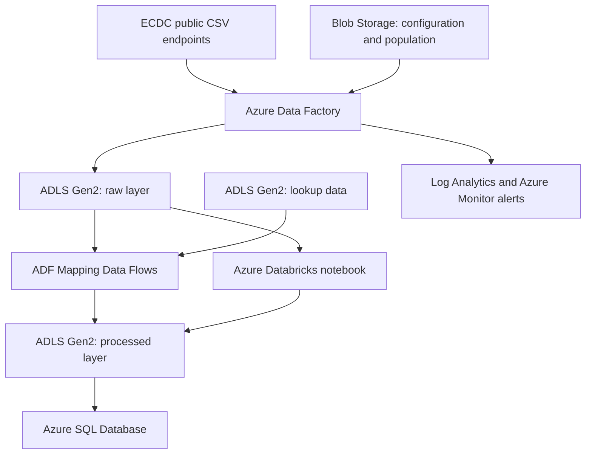
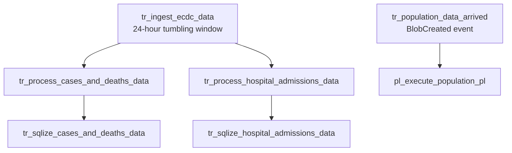

# Azure Data Factory COVID Reporting Pipeline

[](https://azure.microsoft.com/products/data-factory/)
[](https://azure.microsoft.com/products/databricks/)
[](https://azure.microsoft.com/products/azure-sql/)
[](https://github.com/PeterMeliska)

An end-to-end Azure data engineering project that orchestrates the ingestion, validation, transformation and serving of European COVID-19 data. The solution uses Azure Data Factory as the orchestration layer, Azure Data Lake Storage Gen2 for layered storage, Mapping Data Flows and Azure Databricks for transformation, and Azure SQL Database as the reporting layer.

The project prepares reporting-ready datasets for COVID-19 cases, deaths, hospital and ICU admissions, testing and population analysis. Its output can be consumed by Power BI, SQL clients or other analytics tools.

> **Portfolio focus:** metadata-driven ingestion, dependent triggers, event-driven processing, data quality validation, cloud transformation, monitoring and Git-integrated ADF development.

## Table of contents

- [Solution highlights](#solution-highlights)
- [Architecture](#architecture)
- [Azure services](#azure-services)
- [End-to-end data flow](#end-to-end-data-flow)
- [Pipelines and orchestration](#pipelines-and-orchestration)
- [Repository structure](#repository-structure)
- [How to deploy and run](#how-to-deploy-and-run)
- [Monitoring and reliability](#monitoring-and-reliability)
- [What this project demonstrates](#what-this-project-demonstrates)
- [Current repository scope](#current-repository-scope)
- [Potential improvements](#potential-improvements)

## Solution highlights

- **9 ADF pipelines** separated into ingestion, processing, execution and SQL serving layers.
- **2 Mapping Data Flows** for cases/deaths and hospital-admission transformations.
- **16 datasets**, **6 linked services** and **6 triggers** stored as source-controlled ADF JSON definitions.
- **Metadata-driven ingestion** from multiple ECDC CSV endpoints using a configuration file, Lookup and parallel ForEach execution.
- **Data quality gate** that validates the population file, reads its metadata and verifies the expected 13-column structure before processing.
- **Daily dependency chain** implemented with 24-hour Tumbling Window triggers.
- **Event-driven population pipeline** started when a new compressed population file arrives in Blob Storage.
- **Reporting layer in Azure SQL Database** loaded from curated files in ADLS Gen2.
- **Operational monitoring** through Log Analytics, a metric alert rule and an Azure Monitor action group.

## Architecture


The architecture separates orchestration, storage, transformation and serving concerns. Raw source files are preserved in the data lake, transformations write curated outputs to a separate processed layer, and the final relational tables are exposed through Azure SQL Database.



### Azure resource group

The regional services are deployed in **Germany West Central**; the metric alert rule and action group are global Azure resources. The environment includes the core data platform, identity and monitoring resources shown below.


## Azure services

| Service | Resource in the project | Purpose |
| --- | --- | --- |
| Azure Data Factory | `covid-reporting-adf-project-peter` | Orchestrates ingestion, validation, transformation and SQL loading. |
| Azure Data Lake Storage Gen2 | `projectcoviddl` | Stores `raw`, `lookup` and `processed` data layers. |
| Azure Blob Storage | `projectcovidreport` | Stores the ECDC ingestion configuration and compressed population input. |
| Azure Databricks | `project-covid-report-databricks` | Runs the population transformation notebook. |
| Azure SQL Database | SQL server `covid-servi`, database `report-covid-db` | Serves reporting-ready relational tables in the `covid_reporting` schema. |
| Log Analytics workspace | `covid-reporting-ws` | Centralizes operational telemetry. |
| Azure Monitor | `al_trigger_failures` and `covid-suppor-project` | Detects failures and routes notifications through an action group. |
| Azure identity resources | `covid-project-ex-ac` and `covid-project-hdinsight` | Support managed access scenarios; they are deployed in the resource group but are not directly referenced by the checked-in ADF objects. |
| GitHub | This repository | Stores the ADF collaboration-branch definitions and project documentation. |

## End-to-end data flow

### 1. ECDC ingestion

1. `pl_ingest_ecdcs_data` reads `configs/ecdc_file_list.json` from Blob Storage.
2. A Lookup activity returns the configured ECDC source endpoints and target file names.
3. A parallel ForEach activity downloads every CSV through the parameterized HTTP linked service.
4. Copy activities write the files into the ADLS Gen2 `raw/ecdc` area.

The configuration-driven design allows another ECDC file to be added without creating another Copy activity.

### 2. Cases and deaths processing

The `df_trasnsform_cases_deaths` Mapping Data Flow:

- reads raw cases/deaths data and the country lookup;
- filters the dataset to European countries with valid country codes;
- selects and renames required fields;
- pivots the `indicator` values into `cases_count` and `deaths_count` columns;
- enriches records with two- and three-digit country codes;
- writes `processed/ecdc/cases_deaths/cases_and_deaths.csv`.

### 3. Hospital and ICU processing

The `ds_transform_hospital_admissions` Mapping Data Flow:

- reads hospital/ICU admissions, country lookup and date-dimension data;
- enriches source records with country codes and population;
- splits daily occupancy metrics from weekly admissions metrics;
- derives week start and end dates from the date dimension;
- pivots the indicator values into analysis-ready columns;
- writes daily and weekly outputs into separate processed folders.

### 4. Population processing

1. Uploading `population_by_age.tsv.gz` creates a Blob Event.
2. `tr_population_data_arrived` starts `pl_execute_population_pl`.
3. The ingestion pipeline waits for a non-empty file, retrieves metadata and verifies the expected **13 columns**.
4. Valid data is decompressed and copied from Blob Storage to `raw/population/population_by_age.tsv` in ADLS Gen2.
5. The source file is removed after a successful copy.
6. A Databricks notebook transforms the population dataset.

### 5. SQL serving layer

The SQLize pipelines copy curated files from ADLS Gen2 into Azure SQL Database:

- `covid_reporting.cases_and_deaths`
- `covid_reporting.hospital_admissions_daily`
- `covid_reporting.testing`

The current implementation uses a full-refresh pattern: each target table is truncated before new records are inserted.

## Pipelines and orchestration

| Pipeline | Main activity | Role |
| --- | --- | --- |
| `pl_ingest_ecdcs_data` | Lookup + ForEach + Copy | Metadata-driven ECDC HTTP ingestion. |
| `pl_ingest_population_data` | Validation + Get Metadata + If Condition + Copy | Validates, decompresses and lands population data. |
| `pl_process_cases_deaths_data` | Execute Data Flow | Transforms cases and deaths. |
| `pl_process_hospital_admission_data` | Execute Data Flow | Produces daily and weekly hospital/ICU datasets. |
| `pl_process_population_data` | Databricks Notebook | Executes the population transformation. |
| `pl_execute_population_pl` | Execute Pipeline | Runs population ingestion and processing in sequence. |
| `pl_sqlize_cases_deaths` | Copy | Full-refresh load into the cases/deaths SQL table. |
| `pl_sqlize_hospital_admissions_daily_data` | Copy | Full-refresh load into the daily hospital SQL table. |
| `pl_sqlize_testing_data` | Copy | Full-refresh load into the testing SQL table. |

### Trigger dependencies



The dependency graph prevents serving pipelines from starting before their transformations have completed successfully. The population workflow is independent and event-driven.

## Repository structure

```text
AzureDataFactory_Covid_Project/
├── README.md
├── docs/
│   └── images/
│       ├── architecture.svg
│       └── resource-group-overview.png
└── adf-resourcer/
    ├── factory/          # Data Factory definition and managed identity
    ├── linkedService/    # HTTP, Blob, ADLS, Databricks and Azure SQL connections
    ├── dataset/          # Source, lookup, processed and SQL datasets
    ├── dataflow/         # Mapping Data Flow definitions
    ├── pipeline/         # Ingest, process, execute and SQLize pipelines
    ├── trigger/          # Tumbling Window and Blob Event triggers
    └── publish_config.json
```

ADF is configured to use `main` as the collaboration branch and `adf_publish` as the publish branch. Publishing from ADF Studio creates or updates the deployment artifacts in the publish branch.

## How to deploy and run

### Prerequisites

- An active Azure subscription.
- Permission to create and configure Azure Data Factory, Storage, Databricks and Azure SQL resources.
- A GitHub account if Git integration is used.
- Valid ADF access to the required storage resources through managed identity or securely configured credentials.
- A Databricks cluster and a population transformation notebook, or an equivalent replacement.

### 1. Clone the repository

```bash
git clone https://github.com/PeterMeliska/AzureDataFactory_Covid_Project.git
cd AzureDataFactory_Covid_Project
```

### 2. Provision the target Azure resources

Create the following resources in one region where possible:

- Azure Data Factory
- Storage account with hierarchical namespace enabled for ADLS Gen2
- Blob Storage account or containers for configuration and population inputs
- Azure Databricks workspace and compute
- Azure SQL server and database
- Log Analytics workspace, metric alert rule and action group

Configure secure storage access for Data Factory. When using its managed identity, grant only the required data-plane roles. For a portfolio or production-ready deployment, prefer managed identity and Azure Key Vault over embedded credentials.

### 3. Connect ADF to the repository

In **ADF Studio → Manage → Git configuration**:

| Setting | Value |
| --- | --- |
| Repository type | GitHub |
| Repository | `PeterMeliska/AzureDataFactory_Covid_Project` or your fork |
| Collaboration branch | `main` |
| Root folder | `/adf-resourcer` |
| Publish branch | `adf_publish` |

After loading the collaboration branch, validate the factory before publishing.

### 4. Reconfigure linked services

Update and test these linked services for your environment:

| Linked service | Required configuration |
| --- | --- |
| `ls_http_opendata_ecdc_europa_eu` | Anonymous HTTP access; base URL is supplied dynamically. |
| `ls_ablob_projectcovidreport` | Blob Storage account containing `configs` and `population`. |
| `ls_adls_projectcoviddl` | ADLS Gen2 account containing `raw`, `lookup` and `processed`. |
| `ls_db_covid_cluster` | Databricks workspace, authentication and compute. |
| `ls_sql_covid_db` | Azure SQL server, database and authentication. |
| `AzureDatabricks2` | Additional Databricks connection definition; not referenced by the current pipelines. |

> ADF `encryptedCredential` values are encrypted for the original factory and are not portable. Create new credentials or use managed identity/Key Vault in the target environment.

### 5. Prepare the storage layout

```text
Blob Storage: projectcovidreport
├── configs/ecdc_file_list.json
└── population/population_by_age.tsv.gz

ADLS Gen2: projectcoviddl
├── raw/ecdc/
├── raw/population/
├── lookup/country_lookup/country_lookup.csv
├── lookup/dim_date/dim_date.csv
└── processed/ecdc/
```

`country_lookup.csv` must contain:

```text
country,country_code_2_digit,country_code_3_digit,continent,population
```

`dim_date.csv` must contain:

```text
date_key,date,year,month,day,day_name,day_of_year,week_of_month,week_of_year,month_name,year_month,year_week
```

Example `ecdc_file_list.json`:

```json
[
  {
    "sourceBaseURL": "https://opendata.ecdc.europa.eu/",
    "sourceRelativeURL": "covid19/nationalcasedeath/csv/data.csv",
    "sinkFileName": "cases_deaths.csv"
  },
  {
    "sourceBaseURL": "https://opendata.ecdc.europa.eu/",
    "sourceRelativeURL": "covid19/hospitalicuadmissionrates/csv/data.csv",
    "sinkFileName": "hospital_admissions.csv"
  },
  {
    "sourceBaseURL": "https://opendata.ecdc.europa.eu/",
    "sourceRelativeURL": "covid19/testing/csv/data.csv",
    "sinkFileName": "testing.csv"
  }
]
```

Public source directory: [European Centre for Disease Prevention and Control — COVID-19 open data](https://opendata.ecdc.europa.eu/covid19/).

### 6. Create the Azure SQL reporting objects

The following example schema is aligned with the current ADF sink mappings:

```sql
IF SCHEMA_ID(N'covid_reporting') IS NULL
    EXEC(N'CREATE SCHEMA covid_reporting');
GO

IF OBJECT_ID(N'covid_reporting.cases_and_deaths', N'U') IS NULL
BEGIN
    CREATE TABLE covid_reporting.cases_and_deaths (
        country                 varchar(100) NULL,
        country_code_2_digit    varchar(2)   NULL,
        country_code_3_digit    varchar(3)   NULL,
        population              bigint       NULL,
        cases_count             bigint       NULL,
        deaths_count            bigint       NULL,
        reported_date           date         NULL,
        source                  varchar(255) NULL
    );
END;
GO

IF OBJECT_ID(N'covid_reporting.hospital_admissions_daily', N'U') IS NULL
BEGIN
    CREATE TABLE covid_reporting.hospital_admissions_daily (
        country                     varchar(100) NULL,
        country_code_2_digit        varchar(2)   NULL,
        country_code_3_digit        varchar(3)   NULL,
        population                  bigint       NULL,
        reported_date               date         NULL,
        hospital_occupancy_count    bigint       NULL,
        icu_occupancy_count         bigint       NULL,
        source                      varchar(255) NULL
    );
END;
GO

IF OBJECT_ID(N'covid_reporting.testing', N'U') IS NULL
BEGIN
    CREATE TABLE covid_reporting.testing (
        country                     varchar(100) NULL,
        country_code_2_digit        varchar(2)   NULL,
        country_code_3_digit        varchar(3)   NULL,
        year_week                   varchar(8)   NULL,
        week_start_date             date         NULL,
        week_end_date               date         NULL,
        new_cases                   bigint       NULL,
        tests_done                  bigint       NULL,
        population                  bigint       NULL,
        testing_data_source         varchar(255) NULL
    );
END;
GO
```

### 7. Configure the Databricks activity

`pl_process_population_data` currently calls an environment-specific user notebook path ending in:

```text
<your-workspace-path>/covid/trans/transform_population_data
```

Create the equivalent notebook in your workspace or change `notebookPath` to your own version-controlled notebook. Confirm that the selected cluster is running and that ADF has permission to attach to it.

### 8. Validate and execute

For a controlled first run, keep the triggers stopped and execute the pipelines manually in this order:

1. `pl_ingest_ecdcs_data`
2. `pl_process_cases_deaths_data`
3. `pl_process_hospital_admission_data`
4. `pl_sqlize_cases_deaths`
5. `pl_sqlize_hospital_admissions_daily_data`
6. `pl_execute_population_pl` after uploading the population input
7. `pl_sqlize_testing_data` only after a compatible processed testing file exists

Verify row counts and sample records in the raw layer, processed layer and Azure SQL tables. When validation succeeds, publish the factory and start the triggers.

## Monitoring and reliability

- **Tumbling Window dependencies** enforce the correct execution order and allow failed windows to be retried.
- **Pipeline concurrency limits** prevent overlapping ingestion runs.
- **Population validation** checks file availability, minimum size and schema width before processing.
- **Log Analytics** provides a central location for operational logs and diagnostics.
- **Metric alert rule** `al_trigger_failures` can notify the `covid-suppor-project` action group when trigger failures occur.
- ADF Monitor can be used to inspect pipeline, activity and trigger runs, duration, inputs, outputs and error details.

## What this project demonstrates

This project provides practical experience with:

- designing an Azure-based batch data pipeline from source to reporting layer;
- building metadata-driven ingestion instead of duplicating activities;
- parameterizing ADF datasets and linked services;
- orchestrating dependent workflows with Tumbling Window and Blob Event triggers;
- applying validation and conditional control flow before data movement;
- transforming data with filters, lookups, joins, splits, pivots and derived date ranges;
- separating raw and processed storage layers in a data lake;
- integrating Azure Data Factory with Azure Databricks and Azure SQL Database;
- implementing full-refresh loading patterns and understanding where incremental loading would be preferable;
- monitoring pipeline failures and connecting cloud data engineering work to business reporting.

**Business value:** the solution converts several public-health source files into consistent, analysis-ready tables while reducing manual download, transformation and refresh work.

## Current repository scope

- The repository contains the ADF collaboration-branch JSON definitions, not a complete infrastructure-as-code deployment.
- The Databricks population notebook is referenced by path but is not stored in this repository.
- `pl_sqlize_testing_data` expects a file in `processed/ecdc/testing`; the upstream testing transformation is not included in the current repository.
- Lookup files, the population input and the ECDC configuration file must be supplied separately.
- Environment-specific resource IDs, service endpoints and credentials must be updated before deployment to another subscription.

These boundaries are documented explicitly so that the repository can be reproduced without implying that external artifacts are included.

## Potential improvements

- Add Bicep or Terraform to provision the complete Azure environment.
- Store the Databricks notebook and supporting code in Git.
- Add the missing testing transformation and trigger dependency.
- Replace factory-specific credentials with managed identity and Azure Key Vault.
- Parameterize resource names, trigger scopes, SQL endpoints and environment settings.
- Introduce CI/CD for development, test and production factories.
- Replace full table truncation with incremental loads, idempotent upserts or partition-based refreshes.
- Add automated data quality checks, reconciliation metrics and pipeline tests.
- Connect the Azure SQL reporting layer to a Power BI semantic model and dashboard.

---

Created as a hands-on Azure Data Engineering portfolio project by [Peter Meliska](https://github.com/PeterMeliska).
