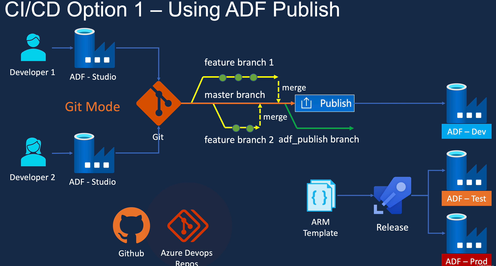
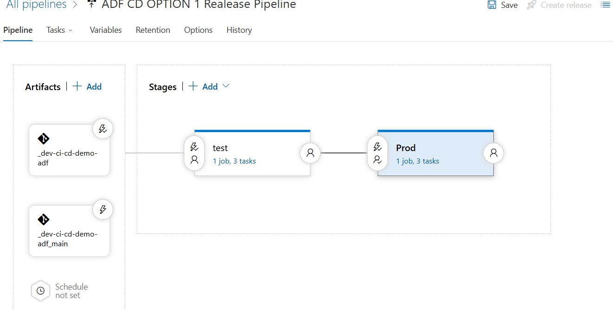
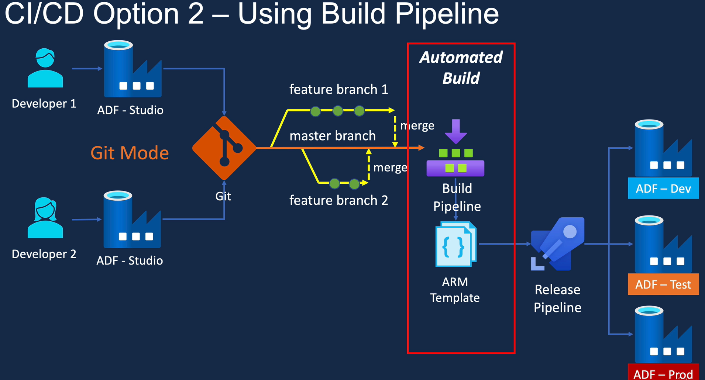
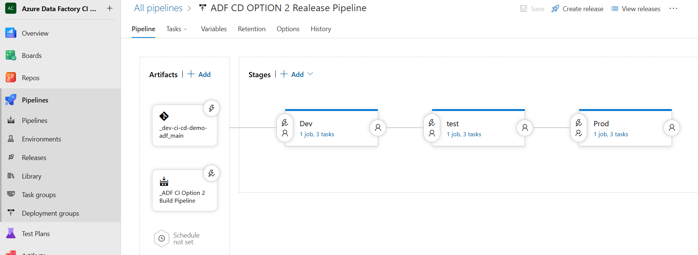

## Future CI/CD Implementation

As a separate hands-on exercise, I explored two CI/CD approaches for deploying Azure Data Factory across **Development, Test and Production** environments:

* **ADF Publish:** ARM templates are generated in the `adf_publish` branch and deployed through an Azure DevOps Release Pipeline.
* **Automated Build:** a Build Pipeline validates ADF resources and generates deployment artifacts before staged release.

This exercise demonstrates branch-based development, environment separation and controlled deployment. It is documented as a potential future extension and is not currently integrated into this project.

